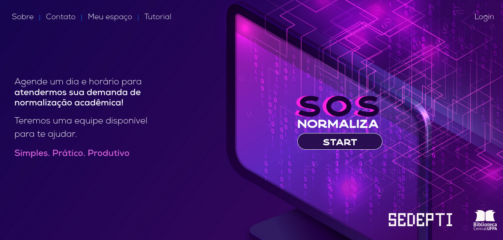

# SOS Normaliza

  
  
  
  
  
  
  
  
  
  
  

> Sistema de agendamento de consultoria especializada de bibliotecários para estudantes de nível superior, desenvolvido pela SEDEPTI - BC da UFPA

### Ajustes e melhorias

> Em desenvolvimento

## 💻 Pré-requisitos

> Em desenvolvimento

## 🚀 Instalação

> Em desenvolvimento
## ☕ Utilização

> Em desenvolvimento

## 📫 Contribuição

Para contribuir com projeto Perguntas e Respostas, siga estas etapas:

1. Bifurque este repositório.
2. Crie um branch: `git checkout -b <descrição_sucinta>`.
3. Faça suas alterações e confirme-as: `git commit -m '<mensagem_commit>'`
4. Envie para a branch de homologação: `git push origin <nome_do_projeto> / <local>`
5. Crie a solicitação de pull.

Como alternativa, consulte a documentação do GitHub em [como criar uma solicitação pull](https://help.github.com/en/github/collaborating-with-issues-and-pull-requests/creating-a-pull-request).

## 😄 Seja um dos contribuidores 

Quer fazer parte desse projeto? Clique [AQUI](CONTRIBUTING.md) e leia como contribuir.

## 📝 Licença

Esse projeto está sob licença. Veja o arquivo [LICENÇA](LICENCE.md) para mais detalhes.

[⬆ Voltar ao topo](#sos-normaliza) 